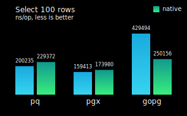

# gopsql

**gopsql** is a simple tool to make PostgreSQL database queries, especially for
developing RESTful API with JSON. Some features are learned from Rails.

## Features

- ✅ Model is a database table and it is created from struct. Column names are
  inferred from struct field names. You can write less SQL statements for CRUD
  operations.
- ✅ Support JSONB data type, you can store many fields in one jsonb column,
  like Rails'
  [store_accessor](https://api.rubyonrails.org/v6.1.3/classes/ActiveRecord/Store.html).
- ✅ Safely insert and update record with Filter() to filter unwanted data,
  like Rails'
  [permit](https://api.rubyonrails.org/v6.1.2.1/classes/ActionController/Parameters.html).
- ✅ Migrate your database like Rails database migrations.
- ✅ Support pq, pgx and go-pg, you can switch driver at runtime.

## Model

For more use cases, see [Examples](tests/examples_test.go) or [Tests](tests/sql_test.go).

### Database Connection

You can choose one of three PostgreSQL drivers (pq, pgx, gopq) to use at runtime:
1. [github.com/lib/pq](https://github.com/lib/pq) v1.9.0
2. [github.com/jackc/pgx](https://github.com/jackc/pgx) v4.10.1
3. [github.com/go-pg/pg](https://github.com/go-pg/pg) v10.9.0

```go
// import "github.com/gopsql/db"
// import "github.com/gopsql/gopg"
// import "github.com/gopsql/pgx"
// import "github.com/gopsql/pq"
connStr := "postgres://localhost:5432/gopsql?sslmode=disable"
connDrv := "gopg"
var conn db.DB
if connDrv == "pgx" {
	conn = pgx.MustOpen(connStr)
} else if connDrv == "gopg" {
	conn = gopg.MustOpen(connStr)
} else {
	conn = pq.MustOpen(connStr)
}
defer conn.Close()
var name string
conn.QueryRow("SELECT current_database()").Scan(&name)
fmt.Println(name) // gopsql
```

If you don't want too much entries being inserted into your go.sum file, you
can use lib/pq:

```go
// import "database/sql"
// import "github.com/gopsql/standard"
// import _ "github.com/lib/pq"
c, err := sql.Open("postgres", "postgres://localhost:5432/gopsql?sslmode=disable")
if err != nil {
	panic(err)
}
conn := &standard.DB{c}
defer conn.Close()
var name string
conn.QueryRow("SELECT current_database()").Scan(&name)
fmt.Println(name) // gopsql
```

### Performance



Select 100 rows from database using different drivers, compared to their native
usages. You can run `cd tests && GENERATE=1 go test -v ./benchmark_test.go` to
make this benchmark chart. For more information, see
[Benchmark](tests/benchmark_test.go).

### New Model

```go
// type (
// 	Post struct {
// 		Id         int
// 		CategoryId int
// 		Title      string
// 		Picture    string `jsonb:"meta"`
// 	}
// )
m := psql.NewModel(Post{}, conn, logger.StandardLogger)
```

### Create Table

```go
// CREATE TABLE users (
//         id SERIAL PRIMARY KEY,
//         category_id bigint DEFAULT 0 NOT NULL,
//         status text DEFAULT ''::text NOT NULL,
//         meta jsonb
// )
m.NewSQLWithValues(m.Schema()).MustExecute()
```

### Insert Record

```go
var newPostId int
m.Insert(
	m.Permit("Title", "Picture").Filter(`{ "Title": "hello", "Picture": "world!" }`),
	"CategoryId", 2,
)("RETURNING id").MustQueryRow(&newPostId)
// or:
m.Insert(
	"Title", "hello",
	"Picture", "world!",
	"CategoryId", 2,
)("RETURNING id").MustQueryRow(&newPostId)
```

### Find Record

```go
var firstPost Post
m.Find("WHERE id = $1", newPostId).MustQuery(&firstPost)
// {1 2 hello world!}

var ids []int
m.Select("id", "ORDER BY id ASC").MustQuery(&ids)
// [1]

// group results by key
var id2title map[int]string
m.Select("id, title").MustQuery(&id2title)
// map[1:hello]

// map's key and value can be int, string, bool, array or struct
// if it is one-to-many, use slice as map's value
var postsByCategoryId map[struct{ categoryId int }][]struct{ title string }
m.Select("category_id, title").MustQuery(&postsByCategoryId)
fmt.Println("map:", postsByCategoryId)
// map[{2}:[{hello}]]

var posts []Post
m.Find().MustQuery(&posts)
// [{1 2 hello world!}]
```

### Update Record

```go
var rowsAffected int
m.Update(
	m.Permit("Picture").Filter(`{ "Picture": "WORLD!" }`),
)("WHERE id = $1", newPostId).MustExecute(&rowsAffected)
```

### Delete Record

```go
var rowsDeleted int
m.Delete("WHERE id = $1", newPostId).MustExecute(&rowsDeleted)
```

### Other

```go
m.MustExists("WHERE id = $1", newPostId) // true or false
m.MustCount() // integer
```
